# CloudSnap 

A serverless image processing pipeline built on AWS — demonstrating cloud infrastructure,
event-driven architecture, CI/CD automation, and production-grade observability.



---

## Overview

CloudSnap accepts image uploads via a REST API, automatically generates thumbnails,
tracks job status in real time, and delivers email notifications on completion —
all without a single always-on server.

| Attribute | Detail |
|---|---|
| **Cloud** | AWS (ap-southeast-2) |
| **Infrastructure** | Terraform (IaC) |
| **Runtime** | Python 3.11 on AWS Lambda |
| **CI/CD** | GitHub Actions |

---

## Architecture

The system is fully serverless and event-driven:

1. Client calls `POST /upload` → API Gateway → **Upload Handler Lambda**
2. Lambda generates a pre-signed S3 URL and creates a job record in DynamoDB
3. Client uploads the image directly to **S3** using the pre-signed URL
4. S3 triggers an event → **SQS queue** → **Processor Lambda**
5. Processor generates a thumbnail using Pillow, saves it to a second S3 bucket,
   updates DynamoDB job status, and sends an email via SNS
6. Client polls `GET /jobs/{id}` → **Status Handler Lambda** → DynamoDB

Failed jobs are retried 3 times via SQS before landing in a **Dead Letter Queue**,
triggering a CloudWatch alarm.

---

## AWS Services Used

| Service | Purpose |
|---|---|
| **API Gateway (HTTP API)** | Public REST API with throttling and CORS |
| **Lambda (×3)** | Upload handler, image processor, status handler |
| **S3 (×2)** | Raw uploads bucket, processed thumbnails bucket |
| **SQS + DLQ** | Decoupled processing queue with retry and dead letter handling |
| **DynamoDB** | Job tracking with TTL for automatic record expiry |
| **SNS** | Email notifications for job completion and alarms |
| **CloudWatch** | Dashboard, metric alarms, and access logging |
| **VPC** | Network isolation with private subnet and S3 VPC endpoint |
| **IAM** | Least-privilege roles for Lambda and CI/CD |
| **AWS Budgets** | Monthly cost alerting at 80% and 100% of budget |

---

## API Reference

### POST /upload
Request a pre-signed URL to upload an image.

**Request**
```json
{
  "filename": "photo.jpg",
  "content_type": "image/jpeg"
}
```

**Response**
```json
{
  "job_id": "uuid",
  "upload_url": "https://...",
  "s3_key": "uploads/uuid/photo.jpg"
}
```

### GET /jobs/{job_id}
Check the status of a processing job.

**Response**
```json
{
  "job_id": "uuid",
  "status": "COMPLETED",
  "filename": "photo.jpg",
  "created_at": "2024-01-01T00:00:00+00:00",
  "updated_at": "2024-01-01T00:00:05+00:00",
  "thumbnail_key": "thumbnails/uuid/photo.jpg",
  "error_message": null
}
```

**Job Statuses**

| Status | Meaning |
|---|---|
| `PENDING` | Upload URL generated, waiting for image |
| `PROCESSING` | Processor Lambda is generating thumbnail |
| `COMPLETED` | Thumbnail ready |
| `FAILED` | Processing failed after 3 retries |

---

## CI/CD Pipeline

Every change goes through an automated pipeline: Pull Request → terraform fmt → terraform validate → terraform plan → PR comment
Merge to main → Build Lambda packages → terraform apply → Deployment summary

- Infrastructure changes are reviewed as Terraform plan output on every PR
- Lambda packages are built fresh on every deployment
- No manual `terraform apply` is ever run in production

---

## Local Setup

### Prerequisites
- [Terraform](https://developer.hashicorp.com/terraform/install) >= 1.7
- [AWS CLI](https://aws.amazon.com/cli/) configured with appropriate credentials
- Python 3.11

### Deploy

```bash
# Clone the repo
git clone https://github.com/YOUR_USERNAME/cloudsnap.git
cd cloudsnap

# Build Lambda packages
cd src && ./build.sh && cd ..

# Deploy infrastructure
cd terraform
terraform init
terraform apply -var="notification_email=your@email.com"
```

### Tear Down
```bash
terraform destroy -var="notification_email=your@email.com"
```

---

## Observability

A CloudWatch dashboard monitors the full system in real time:

- **API Gateway** — request count, latency (p50/p99), 4XX/5XX error rates
- **Lambda** — invocations, errors, duration (p99), throttles per function
- **SQS** — queue depth and DLQ message count
- **DynamoDB** — request latency per operation

Alarms notify via email when:
- Any Lambda error rate exceeds 3 errors in 2 consecutive minutes
- Any message arrives in the Dead Letter Queue
- API Gateway 5XX errors exceed 5 in 2 consecutive minutes
- Processor Lambda p99 duration exceeds 4 minutes (80% of timeout)
- Monthly AWS spend exceeds 80% of budget

---

## Key Design Decisions

**Pre-signed URLs over proxy uploads** — clients upload directly to S3 rather than
through Lambda, avoiding Lambda's 6MB payload limit and reducing both cost and latency.

**SQS between S3 and Lambda** — decoupling the upload trigger from processing means
failed jobs are automatically retried up to 3 times without any application-level
retry logic.

**S3 VPC Endpoint** — Lambda accesses S3 through a VPC endpoint rather than a NAT
Gateway, avoiding ~$30/month in data transfer costs while keeping traffic off the
public internet.

**DynamoDB TTL** — job records automatically expire after 7 days, keeping the table
lean without any scheduled cleanup jobs.

---

## Author

**Huu Phuc An Tran**
[GitHub](https://github.com/TranHuuPhucAn) · [LinkedIn](https://www.linkedin.com/in/tr%E1%BA%A7n-h%E1%BB%AFu-ph%C3%BAc-an-4139632a7/)